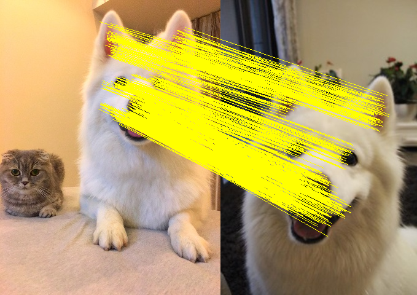
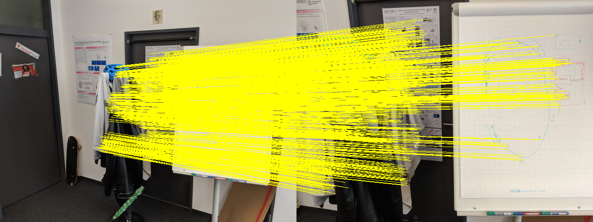

# Grid-base Motion Statistics Matching

Implementation of the matching algorithm proposed in:

JiaWang Bian, Wen-Yan Lin, Yasuyuki Matsushita, Sai-Kit Yeung, Tan Dat Nguyen, Ming-Ming Cheng, **GMS: Grid-based Motion Statistics for Fast, Ultra-robust Feature Correspondence**, **CVPR 2017**, [[pdf](http://jwbian.net/Papers/GMS_CVPR17.pdf)]

## Comparison GMS, None, RatioTest
#### GMS

#### No filtering

#### Ratio Test

